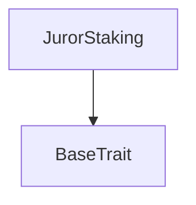

# Tact compilation report
Contract: JurorStaking
BoC Size: 2789 bytes

## Structures (Structs and Messages)
Total structures: 21

### DataSize
TL-B: `_ cells:int257 bits:int257 refs:int257 = DataSize`
Signature: `DataSize{cells:int257,bits:int257,refs:int257}`

### SignedBundle
TL-B: `_ signature:fixed_bytes64 signedData:remainder<slice> = SignedBundle`
Signature: `SignedBundle{signature:fixed_bytes64,signedData:remainder<slice>}`

### StateInit
TL-B: `_ code:^cell data:^cell = StateInit`
Signature: `StateInit{code:^cell,data:^cell}`

### Context
TL-B: `_ bounceable:bool sender:address value:int257 raw:^slice = Context`
Signature: `Context{bounceable:bool,sender:address,value:int257,raw:^slice}`

### SendParameters
TL-B: `_ mode:int257 body:Maybe ^cell code:Maybe ^cell data:Maybe ^cell value:int257 to:address bounce:bool = SendParameters`
Signature: `SendParameters{mode:int257,body:Maybe ^cell,code:Maybe ^cell,data:Maybe ^cell,value:int257,to:address,bounce:bool}`

### MessageParameters
TL-B: `_ mode:int257 body:Maybe ^cell value:int257 to:address bounce:bool = MessageParameters`
Signature: `MessageParameters{mode:int257,body:Maybe ^cell,value:int257,to:address,bounce:bool}`

### DeployParameters
TL-B: `_ mode:int257 body:Maybe ^cell value:int257 bounce:bool init:StateInit{code:^cell,data:^cell} = DeployParameters`
Signature: `DeployParameters{mode:int257,body:Maybe ^cell,value:int257,bounce:bool,init:StateInit{code:^cell,data:^cell}}`

### StdAddress
TL-B: `_ workchain:int8 address:uint256 = StdAddress`
Signature: `StdAddress{workchain:int8,address:uint256}`

### VarAddress
TL-B: `_ workchain:int32 address:^slice = VarAddress`
Signature: `VarAddress{workchain:int32,address:^slice}`

### BasechainAddress
TL-B: `_ hash:Maybe int257 = BasechainAddress`
Signature: `BasechainAddress{hash:Maybe int257}`

### Stake
TL-B: `stake#651fad55 amount:int257 = Stake`
Signature: `Stake{amount:int257}`

### Unstake
TL-B: `unstake#ba522821 amount:int257 = Unstake`
Signature: `Unstake{amount:int257}`

### ClaimReward
TL-B: `claim_reward#80432205  = ClaimReward`
Signature: `ClaimReward{}`

### PauseStaker
TL-B: `pause_staker#207d98fe target:address untilTs:int257 = PauseStaker`
Signature: `PauseStaker{target:address,untilTs:int257}`

### ToggleEmergency
TL-B: `toggle_emergency#3fb417c4 value:bool = ToggleEmergency`
Signature: `ToggleEmergency{value:bool}`

### RecordParticipation
TL-B: `record_participation#850ff690 target:address deltaPoints:int257 = RecordParticipation`
Signature: `RecordParticipation{target:address,deltaPoints:int257}`

### CreditRewards
TL-B: `credit_rewards#115fe710 marketId:int257 reward:int257 payouts:Maybe ^cell = CreditRewards`
Signature: `CreditRewards{marketId:int257,reward:int257,payouts:Maybe ^cell}`

### ApplySlash
TL-B: `apply_slash#993b56b1 marketId:int257 entries:Maybe ^cell = ApplySlash`
Signature: `ApplySlash{marketId:int257,entries:Maybe ^cell}`

### SetPrediction
TL-B: `set_prediction#44ca16dd target:address = SetPrediction`
Signature: `SetPrediction{target:address}`

### StakeInfo
TL-B: `_ amount:int257 accumulatedSeconds:int257 lastUpdate:int257 penaltyCount:int257 pausedUntil:int257 pendingReward:int257 points:int257 = StakeInfo`
Signature: `StakeInfo{amount:int257,accumulatedSeconds:int257,lastUpdate:int257,penaltyCount:int257,pausedUntil:int257,pendingReward:int257,points:int257}`

### JurorStaking$Data
TL-B: `_ admin:address prediction:address treasury:address emergencyPaused:bool totalStaked:int257 stakes:dict<address, ^StakeInfo{amount:int257,accumulatedSeconds:int257,lastUpdate:int257,penaltyCount:int257,pausedUntil:int257,pendingReward:int257,points:int257}> rewardCredits:dict<address, int> = JurorStaking`
Signature: `JurorStaking{admin:address,prediction:address,treasury:address,emergencyPaused:bool,totalStaked:int257,stakes:dict<address, ^StakeInfo{amount:int257,accumulatedSeconds:int257,lastUpdate:int257,penaltyCount:int257,pausedUntil:int257,pendingReward:int257,points:int257}>,rewardCredits:dict<address, int>}`

## Get methods
Total get methods: 5

## stakeOf
Argument: user

## stakeAmountOf
Argument: user

## stakeDaysOf
Argument: user

## whitelistQuotaOf
Argument: user

## rewardCreditOf
Argument: user

## Exit codes
* 2: Stack underflow
* 3: Stack overflow
* 4: Integer overflow
* 5: Integer out of expected range
* 6: Invalid opcode
* 7: Type check error
* 8: Cell overflow
* 9: Cell underflow
* 10: Dictionary error
* 11: 'Unknown' error
* 12: Fatal error
* 13: Out of gas error
* 14: Virtualization error
* 32: Action list is invalid
* 33: Action list is too long
* 34: Action is invalid or not supported
* 35: Invalid source address in outbound message
* 36: Invalid destination address in outbound message
* 37: Not enough Toncoin
* 38: Not enough extra currencies
* 39: Outbound message does not fit into a cell after rewriting
* 40: Cannot process a message
* 41: Library reference is null
* 42: Library change action error
* 43: Exceeded maximum number of cells in the library or the maximum depth of the Merkle tree
* 50: Account state size exceeded limits
* 128: Null reference exception
* 129: Invalid serialization prefix
* 130: Invalid incoming message
* 131: Constraints error
* 132: Access denied
* 133: Contract stopped
* 134: Invalid argument
* 135: Code of a contract was not found
* 136: Invalid standard address
* 138: Not a basechain address
* 3118: AMOUNT_ZERO
* 12134: NO_STAKE
* 28436: STAKE_TOO_SMALL
* 29352: NO_REWARD
* 36991: SUSPENDED
* 41711: NOT_PREDICTION
* 45917: NOT_ADMIN
* 46277: INSUFFICIENT_STAKE
* 63709: EMERGENCY

## Trait inheritance diagram

## Contract dependency diagram

