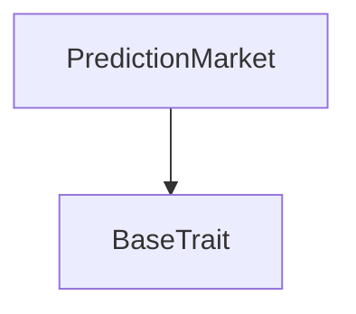
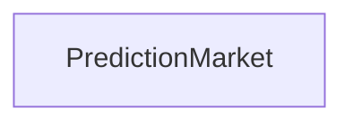

# Tact compilation report
Contract: PredictionMarket
BoC Size: 3308 bytes

## Structures (Structs and Messages)
Total structures: 25

### DataSize
TL-B: `_ cells:int257 bits:int257 refs:int257 = DataSize`
Signature: `DataSize{cells:int257,bits:int257,refs:int257}`

### SignedBundle
TL-B: `_ signature:fixed_bytes64 signedData:remainder<slice> = SignedBundle`
Signature: `SignedBundle{signature:fixed_bytes64,signedData:remainder<slice>}`

### StateInit
TL-B: `_ code:^cell data:^cell = StateInit`
Signature: `StateInit{code:^cell,data:^cell}`

### Context
TL-B: `_ bounceable:bool sender:address value:int257 raw:^slice = Context`
Signature: `Context{bounceable:bool,sender:address,value:int257,raw:^slice}`

### SendParameters
TL-B: `_ mode:int257 body:Maybe ^cell code:Maybe ^cell data:Maybe ^cell value:int257 to:address bounce:bool = SendParameters`
Signature: `SendParameters{mode:int257,body:Maybe ^cell,code:Maybe ^cell,data:Maybe ^cell,value:int257,to:address,bounce:bool}`

### MessageParameters
TL-B: `_ mode:int257 body:Maybe ^cell value:int257 to:address bounce:bool = MessageParameters`
Signature: `MessageParameters{mode:int257,body:Maybe ^cell,value:int257,to:address,bounce:bool}`

### DeployParameters
TL-B: `_ mode:int257 body:Maybe ^cell value:int257 bounce:bool init:StateInit{code:^cell,data:^cell} = DeployParameters`
Signature: `DeployParameters{mode:int257,body:Maybe ^cell,value:int257,bounce:bool,init:StateInit{code:^cell,data:^cell}}`

### StdAddress
TL-B: `_ workchain:int8 address:uint256 = StdAddress`
Signature: `StdAddress{workchain:int8,address:uint256}`

### VarAddress
TL-B: `_ workchain:int32 address:^slice = VarAddress`
Signature: `VarAddress{workchain:int32,address:^slice}`

### BasechainAddress
TL-B: `_ hash:Maybe int257 = BasechainAddress`
Signature: `BasechainAddress{hash:Maybe int257}`

### CreateMarket
TL-B: `create_market#864b4da0 closeTime:int257 creatorStake:int257 feeBps:int257 metadata:Maybe ^cell = CreateMarket`
Signature: `CreateMarket{closeTime:int257,creatorStake:int257,feeBps:int257,metadata:Maybe ^cell}`

### PlaceBet
TL-B: `place_bet#3640cd53 marketId:int257 side:int257 amount:int257 = PlaceBet`
Signature: `PlaceBet{marketId:int257,side:int257,amount:int257}`

### LockMarket
TL-B: `lock_market#74c18062 marketId:int257 = LockMarket`
Signature: `LockMarket{marketId:int257}`

### ResolveMarket
TL-B: `resolve_market#77cef32e marketId:int257 outcome:int257 creatorPenalty:int257 rewardPayouts:Maybe ^cell slashList:Maybe ^cell = ResolveMarket`
Signature: `ResolveMarket{marketId:int257,outcome:int257,creatorPenalty:int257,rewardPayouts:Maybe ^cell,slashList:Maybe ^cell}`

### CreditRewards
TL-B: `credit_rewards#115fe710 marketId:int257 reward:int257 payouts:Maybe ^cell = CreditRewards`
Signature: `CreditRewards{marketId:int257,reward:int257,payouts:Maybe ^cell}`

### ApplySlash
TL-B: `apply_slash#993b56b1 marketId:int257 entries:Maybe ^cell = ApplySlash`
Signature: `ApplySlash{marketId:int257,entries:Maybe ^cell}`

### ClaimWinnings
TL-B: `claim_winnings#7190d264 marketId:int257 = ClaimWinnings`
Signature: `ClaimWinnings{marketId:int257}`

### ClaimCreatorStake
TL-B: `claim_creator_stake#5981b2be marketId:int257 = ClaimCreatorStake`
Signature: `ClaimCreatorStake{marketId:int257}`

### VoidMarket
TL-B: `void_market#5e1ecd07 marketId:int257 reason:int257 = VoidMarket`
Signature: `VoidMarket{marketId:int257,reason:int257}`

### WithdrawFees
TL-B: `withdraw_fees#20212c06  = WithdrawFees`
Signature: `WithdrawFees{}`

### Market
TL-B: `_ id:int257 creator:address closeTime:int257 status:int257 outcome:int257 creatorStake:int257 yesPool:int257 noPool:int257 feeBps:int257 rewardBps:int257 platformFees:int257 rewardPool:int257 resolvedAt:int257 metadata:Maybe ^cell = Market`
Signature: `Market{id:int257,creator:address,closeTime:int257,status:int257,outcome:int257,creatorStake:int257,yesPool:int257,noPool:int257,feeBps:int257,rewardBps:int257,platformFees:int257,rewardPool:int257,resolvedAt:int257,metadata:Maybe ^cell}`

### BetPosition
TL-B: `_ yesAmount:int257 noAmount:int257 claimedYes:bool claimedNo:bool = BetPosition`
Signature: `BetPosition{yesAmount:int257,noAmount:int257,claimedYes:bool,claimedNo:bool}`

### PositionBook
TL-B: `_ entries:dict<address, ^BetPosition{yesAmount:int257,noAmount:int257,claimedYes:bool,claimedNo:bool}> = PositionBook`
Signature: `PositionBook{entries:dict<address, ^BetPosition{yesAmount:int257,noAmount:int257,claimedYes:bool,claimedNo:bool}>}`

### AverageAcc
TL-B: `_ sum:int257 count:int257 = AverageAcc`
Signature: `AverageAcc{sum:int257,count:int257}`

### PredictionMarket$Data
TL-B: `_ admin:address treasury:address staking:address nextMarketId:int257 markets:dict<int, ^Market{id:int257,creator:address,closeTime:int257,status:int257,outcome:int257,creatorStake:int257,yesPool:int257,noPool:int257,feeBps:int257,rewardBps:int257,platformFees:int257,rewardPool:int257,resolvedAt:int257,metadata:Maybe ^cell}> positions:dict<int, ^PositionBook{entries:dict<address, ^BetPosition{yesAmount:int257,noAmount:int257,claimedYes:bool,claimedNo:bool}>}> userCredits:dict<address, int> platformVault:int257 = PredictionMarket`
Signature: `PredictionMarket{admin:address,treasury:address,staking:address,nextMarketId:int257,markets:dict<int, ^Market{id:int257,creator:address,closeTime:int257,status:int257,outcome:int257,creatorStake:int257,yesPool:int257,noPool:int257,feeBps:int257,rewardBps:int257,platformFees:int257,rewardPool:int257,resolvedAt:int257,metadata:Maybe ^cell}>,positions:dict<int, ^PositionBook{entries:dict<address, ^BetPosition{yesAmount:int257,noAmount:int257,claimedYes:bool,claimedNo:bool}>}>,userCredits:dict<address, int>,platformVault:int257}`

## Get methods
Total get methods: 3

## marketInfo
Argument: id

## positionOf
Argument: id
Argument: user

## creditOf
Argument: user

## Exit codes
* 2: Stack underflow
* 3: Stack overflow
* 4: Integer overflow
* 5: Integer out of expected range
* 6: Invalid opcode
* 7: Type check error
* 8: Cell overflow
* 9: Cell underflow
* 10: Dictionary error
* 11: 'Unknown' error
* 12: Fatal error
* 13: Out of gas error
* 14: Virtualization error
* 32: Action list is invalid
* 33: Action list is too long
* 34: Action is invalid or not supported
* 35: Invalid source address in outbound message
* 36: Invalid destination address in outbound message
* 37: Not enough Toncoin
* 38: Not enough extra currencies
* 39: Outbound message does not fit into a cell after rewriting
* 40: Cannot process a message
* 41: Library reference is null
* 42: Library change action error
* 43: Exceeded maximum number of cells in the library or the maximum depth of the Merkle tree
* 50: Account state size exceeded limits
* 128: Null reference exception
* 129: Invalid serialization prefix
* 130: Invalid incoming message
* 131: Constraints error
* 132: Access denied
* 133: Contract stopped
* 134: Invalid argument
* 135: Code of a contract was not found
* 136: Invalid standard address
* 138: Not a basechain address
* 3395: POOL_ZERO
* 9429: BAD_STATUS
* 21744: NOTHING_TO_CLAIM
* 23551: NET_ZERO
* 23784: MARKET_NOT_FOUND
* 25335: INVALID_CLOSE
* 26038: ALREADY_LOCKED
* 38657: INVALID_SIDE
* 39367: NOT_RESOLVED
* 41726: MARKET_NOT_OPEN
* 45917: NOT_ADMIN
* 51548: NO_BETS
* 52287: NOT_CREATOR
* 54749: NOT_DONE
* 60082: BET_TOO_SMALL
* 60218: STAKE_TOO_LOW
* 60278: NO_POSITION
* 61685: MARKET_CLOSED
* 61831: BAD_OUTCOME

## Trait inheritance diagram

## Contract dependency diagram

