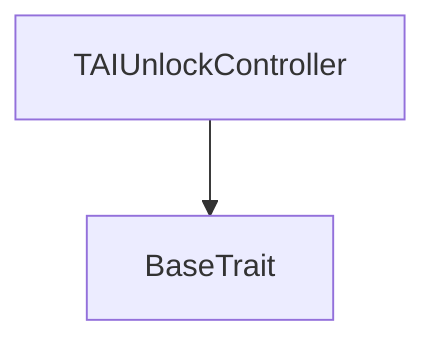
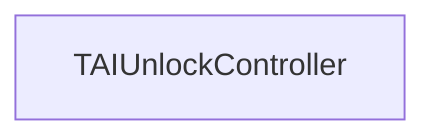

# Tact compilation report
Contract: TAIUnlockController
BoC Size: 6274 bytes

## Structures (Structs and Messages)
Total structures: 29

### DataSize
TL-B: `_ cells:int257 bits:int257 refs:int257 = DataSize`
Signature: `DataSize{cells:int257,bits:int257,refs:int257}`

### SignedBundle
TL-B: `_ signature:fixed_bytes64 signedData:remainder<slice> = SignedBundle`
Signature: `SignedBundle{signature:fixed_bytes64,signedData:remainder<slice>}`

### StateInit
TL-B: `_ code:^cell data:^cell = StateInit`
Signature: `StateInit{code:^cell,data:^cell}`

### Context
TL-B: `_ bounceable:bool sender:address value:int257 raw:^slice = Context`
Signature: `Context{bounceable:bool,sender:address,value:int257,raw:^slice}`

### SendParameters
TL-B: `_ mode:int257 body:Maybe ^cell code:Maybe ^cell data:Maybe ^cell value:int257 to:address bounce:bool = SendParameters`
Signature: `SendParameters{mode:int257,body:Maybe ^cell,code:Maybe ^cell,data:Maybe ^cell,value:int257,to:address,bounce:bool}`

### MessageParameters
TL-B: `_ mode:int257 body:Maybe ^cell value:int257 to:address bounce:bool = MessageParameters`
Signature: `MessageParameters{mode:int257,body:Maybe ^cell,value:int257,to:address,bounce:bool}`

### DeployParameters
TL-B: `_ mode:int257 body:Maybe ^cell value:int257 bounce:bool init:StateInit{code:^cell,data:^cell} = DeployParameters`
Signature: `DeployParameters{mode:int257,body:Maybe ^cell,value:int257,bounce:bool,init:StateInit{code:^cell,data:^cell}}`

### StdAddress
TL-B: `_ workchain:int8 address:uint256 = StdAddress`
Signature: `StdAddress{workchain:int8,address:uint256}`

### VarAddress
TL-B: `_ workchain:int32 address:^slice = VarAddress`
Signature: `VarAddress{workchain:int32,address:^slice}`

### BasechainAddress
TL-B: `_ hash:Maybe int257 = BasechainAddress`
Signature: `BasechainAddress{hash:Maybe int257}`

### SetInitialPrice
TL-B: `set_initial_price#e6259d19 price:int257 timestamp:int257 = SetInitialPrice`
Signature: `SetInitialPrice{price:int257,timestamp:int257}`

### RecordPrice
TL-B: `record_price#bcca4ab6 price:int257 timestamp:int257 round:int257 = RecordPrice`
Signature: `RecordPrice{price:int257,timestamp:int257,round:int257}`

### UnlockRound
TL-B: `unlock_round#892bd199  = UnlockRound`
Signature: `UnlockRound{}`

### PauseUnlock
TL-B: `pause_unlock#b931b732 value:bool = PauseUnlock`
Signature: `PauseUnlock{value:bool}`

### BuyTokens
TL-B: `buy_tokens#4d2a20ab tonAmount:int257 taiAmount:int257 beneficiary:address = BuyTokens`
Signature: `BuyTokens{tonAmount:int257,taiAmount:int257,beneficiary:address}`

### ClaimFission
TL-B: `claim_fission#011da6ad recipient:address amount:int257 = ClaimFission`
Signature: `ClaimFission{recipient:address,amount:int257}`

### RefundSaleRemainder
TL-B: `refund_sale_remainder#ed4b09e1  = RefundSaleRemainder`
Signature: `RefundSaleRemainder{}`

### StartWhitelistSale
TL-B: `start_whitelist_sale#69b6e643 merkleRoot:^cell totalAmount:int257 baselinePrice:int257 currentPrice:int257 windowSeconds:int257 = StartWhitelistSale`
Signature: `StartWhitelistSale{merkleRoot:^cell,totalAmount:int257,baselinePrice:int257,currentPrice:int257,windowSeconds:int257}`

### CancelWhitelistSale
TL-B: `cancel_whitelist_sale#524c6832  = CancelWhitelistSale`
Signature: `CancelWhitelistSale{}`

### PurchaseWhitelist
TL-B: `purchase_whitelist#80ea098e amount:int257 quota:int257 proof:Maybe ^cell beneficiary:address = PurchaseWhitelist`
Signature: `PurchaseWhitelist{amount:int257,quota:int257,proof:Maybe ^cell,beneficiary:address}`

### CloseWhitelistSale
TL-B: `close_whitelist_sale#bc9dc8f4  = CloseWhitelistSale`
Signature: `CloseWhitelistSale{}`

### TriggerEmergencyBuyback
TL-B: `trigger_emergency_buyback#9e1c806e priceNow:int257 pricePrev:int257 = TriggerEmergencyBuyback`
Signature: `TriggerEmergencyBuyback{priceNow:int257,pricePrev:int257}`

### PriceRecord
TL-B: `_ price:int257 timestamp:int257 round:int257 = PriceRecord`
Signature: `PriceRecord{price:int257,timestamp:int257,round:int257}`

### SaleInfo
TL-B: `_ remaining:int257 sold:int257 endTimestamp:int257 closed:bool = SaleInfo`
Signature: `SaleInfo{remaining:int257,sold:int257,endTimestamp:int257,closed:bool}`

### UnlockStatus
TL-B: `_ currentRound:int257 remainingLocked:int257 lastPrice:int257 paused:bool = UnlockStatus`
Signature: `UnlockStatus{currentRound:int257,remainingLocked:int257,lastPrice:int257,paused:bool}`

### SupplySummary
TL-B: `_ total:int257 locked:int257 circulating:int257 = SupplySummary`
Signature: `SupplySummary{total:int257,locked:int257,circulating:int257}`

### WhitelistSaleInfo
TL-B: `_ active:bool total:int257 sold:int257 remaining:int257 baselinePrice:int257 currentPrice:int257 windowEnd:int257 = WhitelistSaleInfo`
Signature: `WhitelistSaleInfo{active:bool,total:int257,sold:int257,remaining:int257,baselinePrice:int257,currentPrice:int257,windowEnd:int257}`

### WhitelistSale
TL-B: `_ active:bool merkleRoot:Maybe ^cell totalAmount:int257 soldAmount:int257 baselinePrice:int257 currentPrice:int257 windowEnd:int257 = WhitelistSale`
Signature: `WhitelistSale{active:bool,merkleRoot:Maybe ^cell,totalAmount:int257,soldAmount:int257,baselinePrice:int257,currentPrice:int257,windowEnd:int257}`

### TAIUnlockController$Data
TL-B: `_ admin:address treasury:address saleEndTimestamp:int257 balances:dict<address, int> whitelistUsage:dict<address, int> remainingSaleSupply:int257 totalSaleSold:int257 saleClosed:bool remainingLocked:int257 currentRound:int257 paused:bool initialPriceSet:bool lastRoundPrice:int257 lastRoundTimestamp:int257 lastRoundId:int257 pendingPrice:Maybe PriceRecord{price:int257,timestamp:int257,round:int257} usdcMaster:address whitelistSale:WhitelistSale{active:bool,merkleRoot:Maybe ^cell,totalAmount:int257,soldAmount:int257,baselinePrice:int257,currentPrice:int257,windowEnd:int257} reserveUsdc:int257 reserveUsdt:int257 = TAIUnlockController`
Signature: `TAIUnlockController{admin:address,treasury:address,saleEndTimestamp:int257,balances:dict<address, int>,whitelistUsage:dict<address, int>,remainingSaleSupply:int257,totalSaleSold:int257,saleClosed:bool,remainingLocked:int257,currentRound:int257,paused:bool,initialPriceSet:bool,lastRoundPrice:int257,lastRoundTimestamp:int257,lastRoundId:int257,pendingPrice:Maybe PriceRecord{price:int257,timestamp:int257,round:int257},usdcMaster:address,whitelistSale:WhitelistSale{active:bool,merkleRoot:Maybe ^cell,totalAmount:int257,soldAmount:int257,baselinePrice:int257,currentPrice:int257,windowEnd:int257},reserveUsdc:int257,reserveUsdt:int257}`

## Get methods
Total get methods: 7

## saleInfo
No arguments

## unlockStatus
No arguments

## lastRecordedPrice
No arguments

## supplySummary
No arguments

## balanceOf
Argument: target

## whitelistSaleInfo
No arguments

## whitelistUsed
Argument: target

## Exit codes
* 2: Stack underflow
* 3: Stack overflow
* 4: Integer overflow
* 5: Integer out of expected range
* 6: Invalid opcode
* 7: Type check error
* 8: Cell overflow
* 9: Cell underflow
* 10: Dictionary error
* 11: 'Unknown' error
* 12: Fatal error
* 13: Out of gas error
* 14: Virtualization error
* 32: Action list is invalid
* 33: Action list is too long
* 34: Action is invalid or not supported
* 35: Invalid source address in outbound message
* 36: Invalid destination address in outbound message
* 37: Not enough Toncoin
* 38: Not enough extra currencies
* 39: Outbound message does not fit into a cell after rewriting
* 40: Cannot process a message
* 41: Library reference is null
* 42: Library change action error
* 43: Exceeded maximum number of cells in the library or the maximum depth of the Merkle tree
* 50: Account state size exceeded limits
* 128: Null reference exception
* 129: Invalid serialization prefix
* 130: Invalid incoming message
* 131: Constraints error
* 132: Access denied
* 133: Contract stopped
* 134: Invalid argument
* 135: Code of a contract was not found
* 136: Invalid standard address
* 138: Not a basechain address
* 2459: DROP_NOT_MET
* 2907: INVALID_QUOTA
* 4561: PRICE_TIME_REWIND
* 5635: UNLOCK_PAUSED
* 6593: INVALID_TIME
* 7807: WL_INACTIVE
* 10757: WINDOW_ACTIVE
* 10849: INVALID_AMOUNT
* 11099: WINDOW_CLOSED
* 13010: NO_ROOT
* 15221: INFLATION_NOT_MET
* 15930: SALE_ACTIVE
* 16021: SALE_CLOSED
* 19104: SALE_ENDED
* 19196: QUOTA_EXCEEDED
* 25076: PRICE_NOT_INITIALIZED
* 25644: PRICE_MISSING
* 26150: SALE_END_PAST
* 26180: ROUND_LIMIT
* 27056: INSUFFICIENT_FUNDS
* 29174: INVALID_WINDOW
* 29358: INVALID_BASELINE
* 30566: TON_UNDERPAID
* 32219: INVALID_TON
* 32395: WL_SOLD_OUT
* 33565: INVALID_PRICE
* 35815: INSUFFICIENT_SALE
* 36606: NO_LOCKED_LIQ
* 36934: PRICE_ALREADY_SET
* 38791: SENDER_MISMATCH
* 43767: SALE_STILL_ACTIVE
* 45917: NOT_ADMIN
* 48891: INVALID_TOTAL
* 50295: INVALID_TRANSFER
* 50349: SALE_ALREADY_CLOSED
* 51795: HOLD_NOT_MET
* 57785: INVALID_PROOF

## Trait inheritance diagram

## Contract dependency diagram

