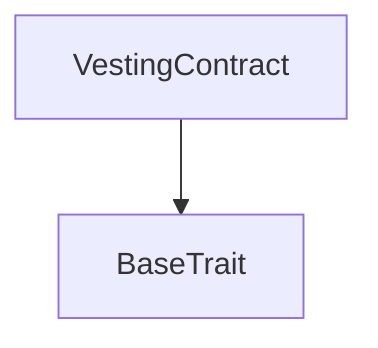

# Tact compilation report
Contract: VestingContract
BoC Size: 963 bytes

## Structures (Structs and Messages)
Total structures: 15

### DataSize
TL-B: `_ cells:int257 bits:int257 refs:int257 = DataSize`
Signature: `DataSize{cells:int257,bits:int257,refs:int257}`

### SignedBundle
TL-B: `_ signature:fixed_bytes64 signedData:remainder<slice> = SignedBundle`
Signature: `SignedBundle{signature:fixed_bytes64,signedData:remainder<slice>}`

### StateInit
TL-B: `_ code:^cell data:^cell = StateInit`
Signature: `StateInit{code:^cell,data:^cell}`

### Context
TL-B: `_ bounceable:bool sender:address value:int257 raw:^slice = Context`
Signature: `Context{bounceable:bool,sender:address,value:int257,raw:^slice}`

### SendParameters
TL-B: `_ mode:int257 body:Maybe ^cell code:Maybe ^cell data:Maybe ^cell value:int257 to:address bounce:bool = SendParameters`
Signature: `SendParameters{mode:int257,body:Maybe ^cell,code:Maybe ^cell,data:Maybe ^cell,value:int257,to:address,bounce:bool}`

### MessageParameters
TL-B: `_ mode:int257 body:Maybe ^cell value:int257 to:address bounce:bool = MessageParameters`
Signature: `MessageParameters{mode:int257,body:Maybe ^cell,value:int257,to:address,bounce:bool}`

### DeployParameters
TL-B: `_ mode:int257 body:Maybe ^cell value:int257 bounce:bool init:StateInit{code:^cell,data:^cell} = DeployParameters`
Signature: `DeployParameters{mode:int257,body:Maybe ^cell,value:int257,bounce:bool,init:StateInit{code:^cell,data:^cell}}`

### StdAddress
TL-B: `_ workchain:int8 address:uint256 = StdAddress`
Signature: `StdAddress{workchain:int8,address:uint256}`

### VarAddress
TL-B: `_ workchain:int32 address:^slice = VarAddress`
Signature: `VarAddress{workchain:int32,address:^slice}`

### BasechainAddress
TL-B: `_ hash:Maybe int257 = BasechainAddress`
Signature: `BasechainAddress{hash:Maybe int257}`

### ConfigurePrice
TL-B: `configure_price#b1fda49e round:int257 price:int257 = ConfigurePrice`
Signature: `ConfigurePrice{round:int257,price:int257}`

### ReleaseRound
TL-B: `release_round#187b6883 round:int257 = ReleaseRound`
Signature: `ReleaseRound{round:int257}`

### RoundStatus
TL-B: `_ price:int257 configured:bool released:bool = RoundStatus`
Signature: `RoundStatus{price:int257,configured:bool,released:bool}`

### VestingSummary
TL-B: `_ totalLocked:int257 released:int257 remaining:int257 lastConfiguredRound:int257 = VestingSummary`
Signature: `VestingSummary{totalLocked:int257,released:int257,remaining:int257,lastConfiguredRound:int257}`

### VestingContract$Data
TL-B: `_ owner:address token:address totalLocked:int257 released:int257 roundPrices:dict<int, int> roundReleased:dict<int, bool> lastConfiguredRound:int257 = VestingContract`
Signature: `VestingContract{owner:address,token:address,totalLocked:int257,released:int257,roundPrices:dict<int, int>,roundReleased:dict<int, bool>,lastConfiguredRound:int257}`

## Get methods
Total get methods: 2

## summary
No arguments

## roundInfo
Argument: roundId

## Exit codes
* 2: Stack underflow
* 3: Stack overflow
* 4: Integer overflow
* 5: Integer out of expected range
* 6: Invalid opcode
* 7: Type check error
* 8: Cell overflow
* 9: Cell underflow
* 10: Dictionary error
* 11: 'Unknown' error
* 12: Fatal error
* 13: Out of gas error
* 14: Virtualization error
* 32: Action list is invalid
* 33: Action list is too long
* 34: Action is invalid or not supported
* 35: Invalid source address in outbound message
* 36: Invalid destination address in outbound message
* 37: Not enough Toncoin
* 38: Not enough extra currencies
* 39: Outbound message does not fit into a cell after rewriting
* 40: Cannot process a message
* 41: Library reference is null
* 42: Library change action error
* 43: Exceeded maximum number of cells in the library or the maximum depth of the Merkle tree
* 50: Account state size exceeded limits
* 128: Null reference exception
* 129: Invalid serialization prefix
* 130: Invalid incoming message
* 131: Constraints error
* 132: Access denied
* 133: Contract stopped
* 134: Invalid argument
* 135: Code of a contract was not found
* 136: Invalid standard address
* 138: Not a basechain address
* 3458: INVALID_ROUND
* 11908: ALREADY_RELEASED
* 20578: ROUND_ONE_LOCKED
* 26180: ROUND_LIMIT
* 33310: ORDER
* 33507: EXCEEDS_LOCKED
* 33565: INVALID_PRICE
* 47989: NOT_OWNER
* 50600: PRICE_NOT_SET

## Trait inheritance diagram

## Contract dependency diagram

